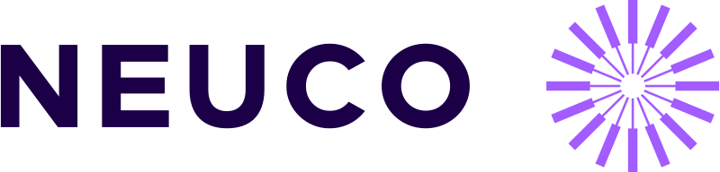

# Bem-vindo à 

## Sobre a Empresa

A NEUCO é uma empresa de tecnologia que atua no mercado de desenvolvimento de software e consultoria em TI. A empresa foi fundada em 2019 e desde então tem se destacado no mercado devido a sua qualidade e comprometimento com seus clientes. A NEUCO tem como missão ajudar empresas a alcançarem seus objetivos através da tecnologia, oferecendo soluções inovadoras e de qualidade.

## Nossos Serviços

- **Consultoria em TI:** Oferecemos consultoria especializada em TI para ajudar nossos clientes a alavancarem a tecnologia em seus negócios.
- **Desenvolvimento de Software:** Nossa equipe de desenvolvimento experiente pode criar soluções de software personalizadas para atender às necessidades exclusivas de cada cliente.
- **Outsourcing de Desenvolvimento:** Fornecemos serviços de outsourcing de TI para ajudar nossos clientes a reduzirem custos, aumentarem a eficiência e focarem em seu core business.

## Principais Stacks e Tecnologias

## Quer trabalhar conosco?

Estamos sempre em busca de novos talentos para se juntar à nossa equipe. Se você é apaixonado por tecnologia e inovação, você pode ser a pessoa que estamos procurando. Como uma forma de apresentação, estamos disponibilizando um teste técnico para que você possa demonstrar suas habilidades. 

Você pode acessar as instruções dos testes através dos links:
* [Hotel California - Desafio Backend](https://github.com/neuco-organization/hotelcalifornia-level1-neucoon-backend)

---
Obrigado por visitar a organização da NEUCO no GitHub. Junte-se a nós enquanto continuamos a impulsionar a inovação e a excelência na indústria de tecnologia.
